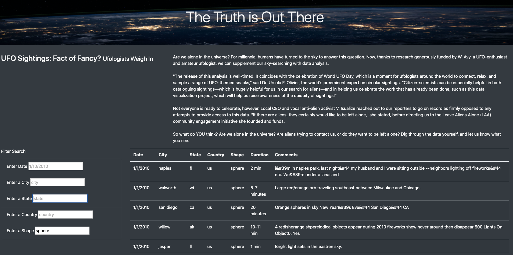

# UFO sightings Analysis

## Overview of the Analysis

In this analysis, we create a table to organize UFO data stored as a JavaScript array, or list. Using JavaScript as the primary coding language, this table can filter data based on specific criteria such as date, city, state, country, and shape. 

## Results of the Analysis 
 
Search criteria allow the user to choose the data that matches certain specifications. By entering the filter in the "filter search" section, as shown in the image below, the script searches the data and returns the information that matches them. The webpage updates with the search criteria after pressing "Enter". 

#### Figure 1 - Filter entered is the shape "sphere"

### Summary

One drawback of this webpage is that the user needs to be familiarized with the data before searching. For example, if the user enters a city that is not in the dataset, the table will be empty, and no message is displayed, leaving the user to think that there may be an error with the webpage. 

To address the drawback mentioned above, a dropdown menu for the filter options could be created, therefore, instead of the user inputting a text, they would have to choose from existing data options. Alternatively, a 'there is no data matching the entered criteria' could be displayed. That way, the user will know that when the table is empty, it's not due to an error with the webpage but to the fact that no data is matching the filter entered. 
